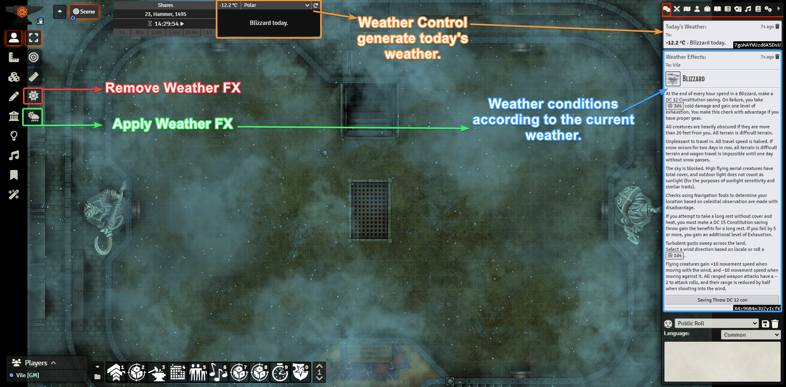
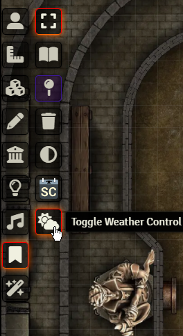
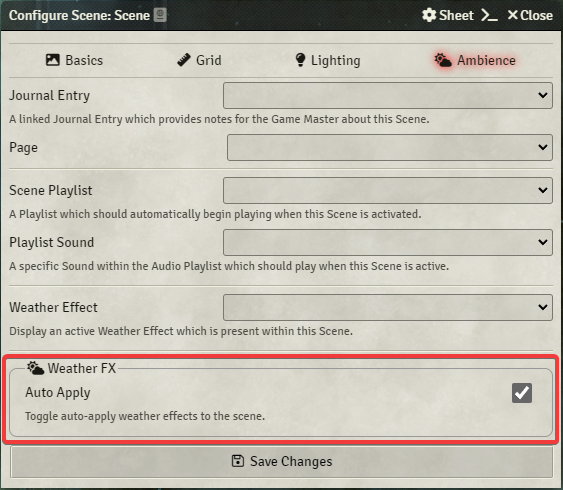
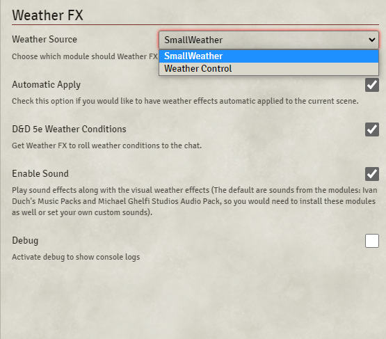

   

  
   
 

# Weather FX
This module automatic generate weather effects on canvas (in the current scene) using [FX Master](https://foundryvtt.com/packages/fxmaster) module API and [Weather Control](https://foundryvtt.com/packages/weather-control) weather generation messages.

Weather FX also provides weather conditions according to the current weather, based on the (now deprecated) Weather Effects 5e module.

## Functions
With the buttons added to the controls on the right side of the screen the GM can either remove or apply Weather FX.

***Toggle Weather Control window app***  
Control button to toggle Weather Control window application (also useful to use when the window disappears)

***Scene configuration***  
The GM is able to disable Weather FX in any scene. This is useful to prevent to add weather effects in very large scenes that may cause lag.

## Settings
**Weather Source**  
*Default: Weather Control*  
Now Weather FX also supports SmallWeather, you only have to select it in the module settings and save.  

**Automatic Apply**  
*Default: active*  
Self explainable, you can have Weather FX auto apply on, thus Weather effects will be applied to the current scene as soon as they are generated by Weather Control.

**D&D5e Weather Conditions**  
*Default: disabled*  
Have Weather FX to roll weather conditions to the chat. Currently only available for DnD5e.

**Enable Sound**  
*Default: active*  
Weather FX also play sounds if you have this option on. The defaults sounds come from the modules Ivan Duch's Music Packs and Michael Ghelfi Studios Audio Pack, although you can customize these in the settings bellow.

## Dependencies
1. [FX Master](https://foundryvtt.com/packages/fxmaster)
2. [Weather Control](https://foundryvtt.com/packages/weather-control)

**Optional**
1. [Ivan Duch's Music Packs](https://foundryvtt.com/packages/ivan-duch-music-packs)
2. [Michael Ghelfi Studios Audio Pack](https://foundryvtt.com/packages/michaelghelfi)

## Known Issues
- Make sure to have Weather Control output to chat **ON**

## Feedback
If you have suggestions or want to report a problem, you can create an issue here: [Issues](../../issues)

## Changelog
You can read the changelog here: [CHANGELOG.md](/CHANGELOG.md)

## Special Thanks
`Peterson`, `roi007leaf`, `Zhell`, `MisterHims`, `Freeze` and `honeybadger`

## Donations
The module is totally free and will remain this way.  
I am unemployed, though. So every little help counts.

## Attributions
The Oxygen Team, KDE;, LGPL <https://www.gnu.org/copyleft/lgpl.html>, via Wikimedia Commons
