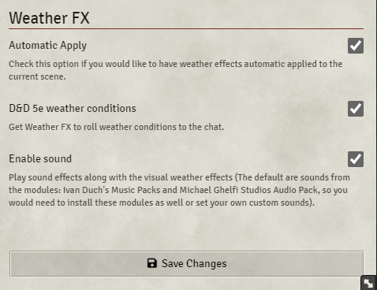

<!--- Downloads @ Latest Badge -->
<!--- replace <user>/<repo> with your username/repository -->
<!--  -->
<!--- Forge Bazaar Install % Badge -->
<!--- replace <your-module-name> with the `name` in your manifest -->
    
   
 

# Weather FX
This module automatic generate weather effects on canvas (in the current scene) using [FX Master](https://foundryvtt.com/packages/fxmaster) module API and [Weather Control](https://foundryvtt.com/packages/weather-control) weather generation messages.

Weather FX also provides weather conditions according to the current weather, based on the (now deprecated) Weather Effects 5e module.

## Functions
With the buttons added to the controls on the right side of the screen the GM can either remove or apply Weather FX.

## Settings
**Automatic Apply**  
Self explainable, you can have Weather FX auto apply on, thus Weather effects will be applied to the current scene as soon as they are generated by Weather Control.

**Enable Sound**  
Weather FX also play sounds if you have this option on. The defaults sounds come from the modules Ivan Duch's Music Packs and Michael Ghelfi Studios Audio Pack, although you can customize these in the settings bellow.

## Dependencies
1. [FX Master](https://foundryvtt.com/packages/fxmaster)
2. [Weather Control](https://foundryvtt.com/packages/weather-control)

**Optional**
1. [Ivan Duch's Music Packs](https://foundryvtt.com/packages/ivan-duch-music-packs)
2. [Michael Ghelfi Studios Audio Pack](https://foundryvtt.com/packages/michaelghelfi)

## Known Issues
- Make sure to have Weather Control ouput to chat **ON**
- Only supports Weather Control in English, this shall be fixed soon.

## Feedback
You can create an issue here: [Issues](../../issues)

## Changelog
### 1.0.0
- Intial release
### 1.1.0
- **Now compatible with FVTT v9**
- You can chose not to use weather chat conditions
### 1.1.1
- Fixed problem that images were not packed with the module.
- Changed the control icons (sun remove weather fx, sun-rain to apply weather fx)

## Special Thanks
`Peterson`, ``Zhell``, ``MisterHims``, ``Freeze`` and `honeybadger`

## Donations
The module is totally free and will remain this way.  
I am unemployed, though. So every little help counts.

## Attributions
The Oxygen Team, KDE;, LGPL <https://www.gnu.org/copyleft/lgpl.html>, via Wikimedia Commons
